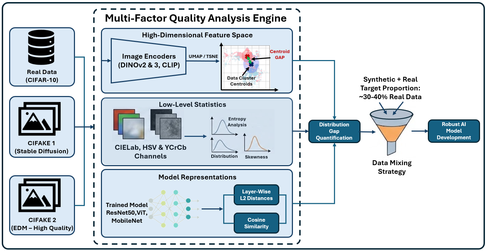

# Data Safety: Synthetic Data Quality Analysis Using CIFAKE Dataset
Recently, the societal implementation of high-performance image classification models has expanded rapidly. While these models require vast amounts of training data to improve performance, securing sufficient real images is often impractical. As a means to compensate for this shortage, the use of synthetic data is becoming widespread. However, synthetic images are not necessarily equivalent to real images for training purposes. This study systematically analyzes the differences between two types of synthetic images created by different generation methods and real images from three perspectives: high-dimensional feature space, low-level statistics in color space, and the model training process. Furthermore, it experimentally verifies how synthetic data should be utilized by considering common data mixing scenarios. This provides guidance on an application strategy for performing preliminary assessments on synthetic images of unknown quality and incorporating them into training. This research aims to contribute more reliable and safer image classification models utilizing synthetic images.
