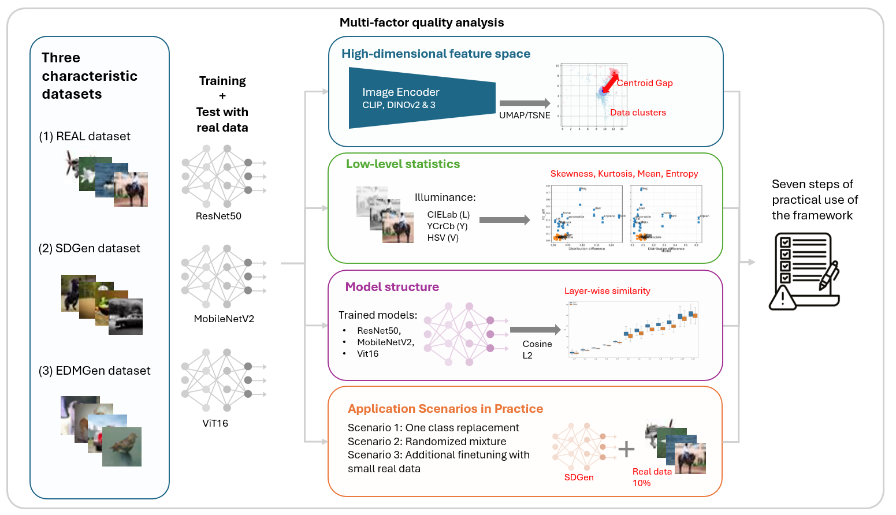

# Title: Data Safety: Synthetic Data Quality Analysis Using CIFAKE Dataset
Abstract: Synthetic images are increasingly used to overcome shortages of real training data, but their visual plausibility does not guarantee that they will support reliable model learning. If synthetic images encode distributional artifacts that differ from real data, models may achieve high performance on synthetic test data while failing to generalize to real-world inputs. This paper investigates this risk in a CIFAR-10-based image-classification setting by comparing real images with two synthetic datasets generated using different diffusion-based methods: Stable Diffusion-generated CIFAKE images and EDM-generated images. Rather than treating the problem as fake-image detection, we examine whether synthetic data is suitable as a training resource. We analyze synthetic-real discrepancies at three complementary levels: high-dimensional visual representations, low-level color and illumination statistics, and the internal learning behavior of classification models. The results show that Stable Diffusion-generated data can produce strong within-domain performance while inducing substantial degradation when models are evaluated on real images, whereas EDM-generated data remains much closer to the real-data distribution. Feature-centroid distances and illumination-entropy differences provide useful indicators of this degradation, linking measurable data-quality gaps to downstream classification performance. Practical data-mixing experiments further show that incorporating real data evenly across classes, particularly at around 30\%, can substantially reduce the performance loss caused by lower-quality synthetic data, while one-class replacement and limited post-hoc fine-tuning are less effective. These findings provide a practical pre-training assessment strategy for using synthetic image data more safely: diagnose synthetic-real distributional gaps before training, identify classes where synthetic data diverges, and adjust the real-data mixing ratio accordingly. The study contributes empirical evidence and operational guidance for more reliable use of synthetic data in image classification.

### Dataset Information

### Code Information and Usage

Training scripts:

| File | Training procedure | Evaluation data |
|---|---|---|
| [main.py](main.py) | Runs baseline experiments by training models separately on REAL, SDGen, and EDMGen. | REAL, SDGen, and EDMGen |
| [random_mix_training.py](random_mix_training.py) | Trains models on mixtures of REAL and SDGen sampled within each class, varying the REAL proportion from 10% to 90% in 10% increments. | REAL |
| [one_class_replacement.py](one_class_replacement.py) | Trains models after replacing one class in SDGen with REAL images of the same class. The current target is frog (label 6). | REAL |
| [additional_finetuning.py](additional_finetuning.py) | Further fine-tunes models previously trained on SDGen using 10% of each class from the REAL training and validation sets. Runs for 150 epochs, saving and evaluating checkpoints every 10 epochs. | REAL |

Shared training and data preparation components:

| File | Role |
|---|---|
| [finetune.py](finetune.py) | Implements training and validation loops, optimization, and checkpoint saving. Uses SGD for CNNs and AdamW for ViT. |
| [model.py](model.py) | Loads ImageNet-pretrained models and defines output layers for 10-class classification. |
| [train_settings.py](train_settings.py) | Defines learning rates, batch sizes, input image sizes, and epoch counts. |
| [data.py](data.py) | Handles data loading, training/validation splits, image transformations, and DataLoader creation. |
| [train_utils.py](train_utils.py) | Provides seed configuration, sampling within each class, and evaluation result export to CSV. |
| [preparing.py](preparing.py) | Creates train.csv and test.csv from the image directories. |

### Requirements
The Python dependencies required to run the code are listed in `requirements.txt`.
Install them with: pip install -r requirements.txt
